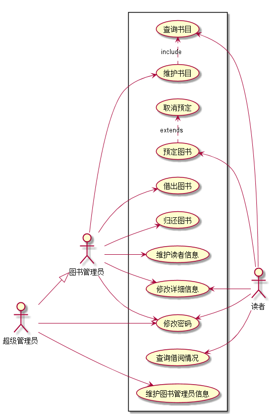

# 实验2：图书管理系统用例建模
|学号|班级|姓名|
|:-------:|:-------------: | :----------:|
|201510414312|软件(本)15-3|邱小霞|

## 1. 图书管理系统的用例关系图

### 1.1 用例图PlantUML源码如下：

``` usecase
@startuml
left to right direction
skinparam packageStyle rectangle
actor 图书管理员
actor 读者
actor 超级管理员
rectangle {
  图书管理员 --> (借出图书)
  图书管理员 -->(归还图书)
  图书管理员 --> (维护书目)
  图书管理员 --> (维护读者信息)
  (查询书目)<-- 读者
  (查询借阅情况)<-- 读者
  (预定图书)<-- 读者
  (维护书目) .> (查询书目) : include
  (预定图书) .> (取消预定) : extends
  超级管理员 --|> 图书管理员
  超级管理员 --> (维护图书管理员信息)
}
@enduml
```


### 1.2. 用例图如下：



## 2. 参与者说明：

###     2.1 图书管理员

主要职责是：借出图书 、归还图书 、维护书目 、维护读者信息

###     2.2 读者

主要职责是：查询书目、查询借阅情况、预定图书、取消预定

###     2.3 其他类型用户
    
主要职责是：维护图书管理员信息

##     3. 用例规约表

###     [3.1 “查询书目”用例](a_list_1.md)
###     [3.2 “维护书目”用例](a_list_2.md)
###     [3.3 “取消预定”用例](a_list_3.md)
###     [3.4 “预定图书”用例](a_list_4.md)
###     [3.5 “借出图书”用例](a_list_5.md)
###     [3.6 “归还图书”用例](a_list_6.md)
###     [3.7 “维护读者信息”用例](a_list_7.md)
###     [3.8 “修改详细信息”用例](a_list_8.md)
###     [3.9 “修改密码”用例](a_list_9.md)
###     [3.10 “查询借阅情况”用例](a_list_10.md)
###     [3.11 “维护图书管理员信息”用例](a_list_11.md)


