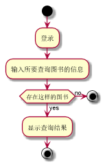

###     3.1 “查询书目”用例
|||
|:-------|:-------------| 
|用例名称|查询书目|
|参与者|超级管理员、图书管理员、读者|
|前置条件|超级管理员、图书管理员或读者登录到系统|
|后置条件|产生并保存查询记录|
|主事件流|
|参与者动作|系统行为|
|1.超级管理员、图书管理员或读者跳转到系统查询书目页面；<br>2.超级管理员、图书管理员或读者输入图书的相关信息；|<br><br><br>3.系统列出所查询的书目的相关信息；<br>4.系统保存相关的查询记录，用例结束；|
|备选事件流|
|1a.没有所查询的书籍<br>&nbsp;&nbsp;&nbsp;&nbsp;1.系统提示没有相关书籍|
|业务规则|
|1.每次可查询到的信息为书籍的名称、库存量、作者、封面、内容等信息<br>2.用户可通过输入书名、内容、作者进行查询<br>3.登录后才可以进行查询操作|
<br>

**“查询书目”用例流程图源码如下：**
``` 
@startuml
start
:登录;
:输入所要查询图书的信息;
if (存在这样的图书) then (no)
stop
else (yes)
:显示查询结果;
endif
stop
@enduml
```
<br>

**“查询书目”用例流程图源码如下：**
<br>

