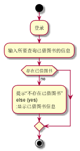

###     3.10 “查询借阅情况”用例
|||
|:-------|:-------------| 
|用例名称|查询借阅情况|
|参与者|读者|
|前置条件|读者登录到系统|
|后置条件|&nbsp;|
|主事件流|
|参与者动作|系统行为|
|1.读者登录到系统查询借阅图书的页面；|<br><br>2.系统显示该读者借阅的图书，用例结束；|
|备选事件流|
|1a.没有借阅书籍<br>&nbsp;&nbsp;&nbsp;&nbsp;1.系统提示没有借阅书籍<br>|
|业务规则|
|&nbsp;|
<br>

**“查询借阅情况”用例流程图源码如下：**
``` 
@startuml
start
:登录;
:输入所要查询已借图书的信息;
if (存在已借图书) then (no)
:提示“不存在已借图书”
else (yes)
:显示已借图书信息;
endif
stop
@enduml
```
<br>

**“查询借阅情况”用例流程图如下：**
<br>
