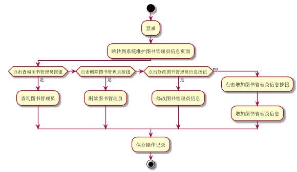

###     3.11 “维护图书管理员信息”用例
|||
|:-------|:-------------| 
|用例名称|维护图书管理员信息|
|参与者|超级管理员|
|前置条件|超级管理员登录到系统|
|后置条件|产生并保存图书管理员信息的维护记录和修改后的图书管理员信息|
|主事件流|
|参与者动作|系统行为|
|1.超级管理员登录到系统图书管理员信息维护页面；<br>2.超级管理员选择并完成相关操作--查询图书管理员信息、删除图书管理员信息、修改图书管理员信息、增加图书管理员；|<br><br><br>3.系统保存相关的图书管理员维护记录，给出相应的提示，用例结束|
|备选事件流|
|1a.查询不存在图书管理员<br>&nbsp;&nbsp;&nbsp;&nbsp;1.系统提示查询没有此图书管理员<br>2a.增加存在的图书管理员<br>&nbsp;&nbsp;&nbsp;&nbsp;1.系统提示图书管理员已存在<br>3a.删除不存在图书管理员<br>&nbsp;&nbsp;&nbsp;&nbsp;1.系统提示图书管理员不存在<br>|
|业务规划|
|1.每次可查询到的信息为图书管理员的编号、姓名等信息<br>2.用户可通过输入图书管理员编号，姓名进行查询<br>3.每个操作都只有在用户登录后才能执行|
<br>

**“维护图书管理员信息”用例流程图源码如下：**
``` 
@startuml
start
:登录;
:跳转到系统维护图书管理员信息页面;
if (点击查询图书管理员按钮) then (是)
:查询图书管理员;
 elseif (点击删除图书管理员按钮) then (是)
:删除图书管理员;
 elseif (点击修改图书管理员信息按钮 ) then (是)
:修改图书管理员信息;
else (no)
  :点击增加图书管理员信息按钮;
  :增加图书管理员信息;
endif
:保存操作记录;
stop
@enduml
```
<br>

**“维护图书管理员信息”用例流程图源码如下：**
<br>
