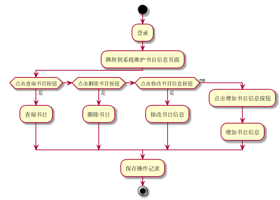

###     3.2 “维护书目”用例
|||
|:-------|:-------------| 
|用例名称|维护书目|
|参与者|超级管理员、图书管理员|
|前置条件|超级管理员、图书管理员登录到系统|
|后置条件|产生并保存图书的维护记录|
|主事件流|
|参与者动作|系统行为|
|1.超级管理员或图书管理员跳转到系统维护书目信息页面；<br>2.超级管理员或图书管理员选择相关操作--查询图书、删除图书、修改图书信息、增加图书信息；|<br><br><br>3.系统保存相关的图书维护记录，给出相应的提示，用例结束|
|备选事件流|
|1a.查询没有相关书籍<br>&nbsp;&nbsp;&nbsp;&nbsp;1.系统提示查询没有相关书籍<br>2a.增加存在的书目<br>&nbsp;&nbsp;&nbsp;&nbsp;1.系统提示书籍已存在<br>3a.删除不存在书目<br>&nbsp;&nbsp;&nbsp;&nbsp;1.系统提示书籍不存在<br>4a.修改信息将库存量设为0<br>&nbsp;&nbsp;&nbsp;&nbsp;1.系统提示书籍库存量不能为0|
|业务规则|
|1.每次可查询到的信息为书籍的名称、库存量、作者、封面、内容等信息<br>2.用户可通过输入书名、内容、作者进行查询<br>3.不能修改书目编号<br>4.每个操作都只有在登录账户才能执行|
<br>

**“维护书目”用例流程图源码如下：**
``` 
@startuml
start
:登录;
:跳转到系统维护书目信息页面;
if (点击查询书目按钮) then (是)
:查询书目;
 elseif (点击删除书目按钮) then (是)
:删除书目;
 elseif (点击修改书目信息按钮 ) then (是)
:修改书目信息;
else (no)
  :点击增加书目信息按钮;
  :增加书目信息;
endif
:保存操作记录;
stop
@enduml
```
<br>

**“维护书目”用例流程图源码如下：**
<br>
