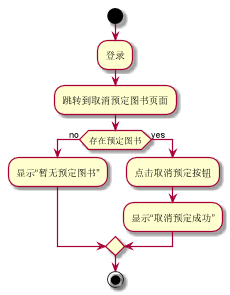

###     3.3 “取消预定”用例
|||
|:-------|:-------------| 
|用例名称|取消预定|
|参与者|读者|
|前置条件|读者登录到系统并存在预定操作的记录|
|后置条件|删除原有的预定记录|
|主事件流|
|参与者动作|系统行为|
|1.读者跳转到系统预定操作的页面；<br><br>3.点击取消预定的按钮；|<br>2.系统列出该读者所预定的书目的信息；<br><br>4.系统保存删除该读者的相关预定记录，提示用户删除成功，用例结束；|
|备选事件流|
|1a.没有预定书籍<br>&nbsp;&nbsp;&nbsp;&nbsp;1.系统提示没有预定书籍<br>|
|业务规则|
|&nbsp;|
<br>

**“取消预定”用例流程图源码如下：**
``` 
@startuml
start
:登录;
:跳转到取消预定图书页面;
if (存在预定图书) then (no)
:显示“暂无预定图书”;
else (yes)
:点击取消预定按钮;
:显示“取消预定成功”;
endif
stop
@enduml

```
<br>

**“取消预定”用例流程图源码如下：**
<br>
