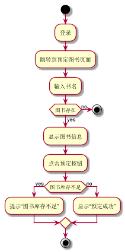

###     3.4 “预定图书”用例
|||
|:-------|:-------------| 
|用例名称|预定图书|
|参与者|读者|
|前置条件|读者登录到系统|
|后置条件|添加预定记录|
|主事件流|
|参与者动作|系统行为|
|1.读者跳转到系统预定操作的页面；<br>2.查询想要预定的书籍；<br><br>4.读者点击预定按钮；|<br><br><br>3.系统列出该读者所查询到的书目的信息；<br><br>5.系统保存预定记录，提示用户预定成功，用例结束；|
|备选事件流|
|1a.想要预定的书籍库存不足<br>&nbsp;&nbsp;&nbsp;&nbsp;1.系统提示相关书籍库存不足|
|业务规则|
|1.每个读者可预定的书目数量不超过10本|
<br>

**“预定图书”用例流程图源码如下：**
``` 
@startuml
start
:登录;
:跳转到预定图书页面;
:输入书名;
if (图书存在) then (no)
stop
else (yes)
:显示图书信息;
:点击预定按钮;
if (图书库存不足) then (yes)
:提示“图书库存不足”;
else (no)
:显示“预定成功”;
endif
stop
@enduml

```
<br>

**“预定图书”用例流程图源码如下：**
<br>
