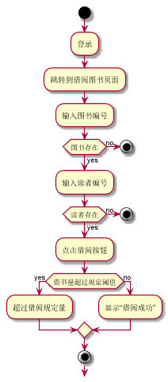

###     3.5 “借出图书”用例
|||
|:-------|:-------------| 
|用例名称|借出图书|
|参与者|超级管理员、图书管理员|
|前置条件|超级管理员、图书管理员登录到系统|
|后置条件|产生并保存借阅记录|
|主事件流|
|参与者动作|系统行为|
|1.超级管理员、图书管理员跳转到系统借阅图书页面；<br>2.超级管理员、图书管理员输入图书的编号；<br><br>4.超级管理员、图书管理员输入读者的信息，点击借阅按钮；|<br><br>3.系统显示读者所借阅的书目的相关信息；<br><br>5.系统保存相关的借阅记录，提示借阅成功，用例结束；|
|备选事件流|
|1a.没有相关书籍<br>&nbsp;&nbsp;&nbsp;&nbsp;1.系统提示没有相关书籍<br>2a.读者借阅书籍已经达到上限<br>&nbsp;&nbsp;&nbsp;&nbsp;1.系统提示读者借书已达上限，不能再借阅图书<br>3a.没有此读者<br>&nbsp;&nbsp;&nbsp;&nbsp;1.系统提示没有此读者|
|业务规划|
|1.读者总共可借阅20本书|
<br>

**“借出图书”用例流程图源码如下：**
``` 
@startuml
start
:登录;
:跳转到借阅图书页面;
:输入图书编号;
if (图书存在) then (no)
stop
else (yes)
:输入读者编号;
if (读者存在) then (no)
stop
else (yes)
:点击借阅按钮;
if (借书量超过规定阈值) then (yes)
:超过借阅规定量;
else (no)
:显示“借阅成功”;
endif
stop
@enduml

```
<br>

**“借出图书”用例流程图源码如下：**
<br>

