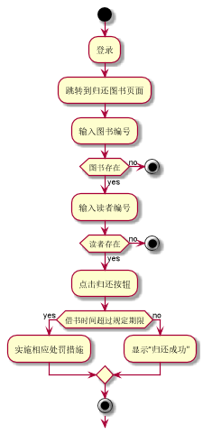

###     3.6 “归还图书”用例
|||
|:-------|:-------------| 
|用例名称|归还图书|
|参与者|超级管理员、图书管理员|
|前置条件|超级管理员、图书管理员登录到系统|
|后置条件|产生并保存归还记录|
|主事件流|
|参与者动作|系统行为|
|1.超级管理员、图书管理员跳转到系统归还图书页面；<br>2.超级管理员、图书管理员输入图书的编号；<br>3.超级管理员、图书管理员输入读者的信息，点击归还按钮；|<br><br><br><br>4.系统保存相关的借阅记录，提示归还成功，用例结束；|
|备选事件流|
|1a.没有相关书籍<br>&nbsp;&nbsp;&nbsp;&nbsp;1.系统提示没有相关书籍<br>2a.图书超期<br>&nbsp;&nbsp;&nbsp;&nbsp;1.系统提示图书超期，并执行相应的处罚措施<br>3a.没有此读者<br>&nbsp;&nbsp;&nbsp;&nbsp;1.系统提示没有此读者|
|业务规则|
|1.读者所借书籍时间不超过20天，20天后自动计费|
<br>

**“归还图书”用例流程图源码如下：**
``` 
@startuml
start
:登录;
:跳转到归还图书页面;
:输入图书编号;
if (图书存在) then (no)
stop
else (yes)
:输入读者编号;
if (读者存在) then (no)
stop
else (yes)
:点击归还按钮;
if (借书时间超过规定期限) then (yes)
:实施相应处罚措施;
else (no)
:显示“归还成功”;
endif
stop
@enduml

```
<br>

**“归还图书”用例流程图如下：**
<br>
