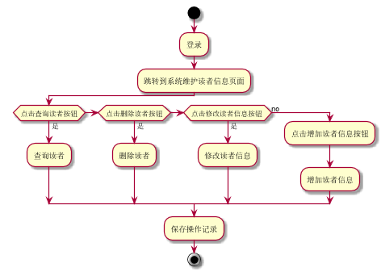

###     3.7 “维护读者信息”用例
|||
|:-------|:-------------| 
|用例名称|维护读者信息|
|参与者|超级管理员、图书管理员|
|前置条件|超级管理员、图书管理员登录到系统|
|后置条件|产生并保存读者信息的维护记录|
|主事件流|
|参与者动作|系统行为|
|1.超级管理员或图书管理员登录到系统维护读者信息页面；<br>2.超级管理员或图书管理员选择并完成相关操作--查询读者、删除读者、修改读者信息、增加读者；|<br><br><br>3.系统保存相关的读者维护记录和修改读者信息，给出相应的提示，用例结束|
|备选事件流|
|1a.查询没有此读者<br>&nbsp;&nbsp;&nbsp;&nbsp;1.系统提示查询没有此读者<br>2a.增加存在的读者<br>&nbsp;&nbsp;&nbsp;&nbsp;1.系统提示读者已存在<br>3a.删除不存在读者<br>&nbsp;&nbsp;&nbsp;&nbsp;1.系统提示读者不存在<br>|
|业务规划|
|1.每次可查询到的信息为读者的编号、姓名等信息<br>2.用户可通过输入读者编号，姓名进行查询<br>3.每个操作都只有在用户登录账户才能执行<br>4.不能修改读者编号|
<br>

**“维护读者信息”用例流程图源码如下：**
``` 
@startuml
       start
       :登录;
       :跳转到系统维护读者信息页面;
       if (点击查询读者按钮) then (是)
       :查询读者;
        elseif (点击删除读者按钮) then (是)
       :删除读者;
        elseif (点击修改读者信息按钮 ) then (是)
       :修改读者信息;
       else (no)
         :点击增加读者信息按钮;
         :增加读者信息;
       endif
       :保存操作记录;
       stop
       @enduml
```
<br>

**“维护读者信息”用例流程图源码如下：**
<br>
