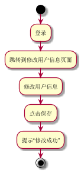

###     3.8 “修改详细信息”用例
|||
|:-------|:-------------| 
|用例名称|修改详细信息|
|参与者|图书管理员、读者|
|前置条件|图书管理员或读者登录到系统|
|后置条件|产生并保存新的详细信息记录和修改后的详细信息|
|主事件流|
|参与者动作|系统行为|
|1.图书管理员或读者登录到修改详细信息的页面；<br><br>3.图书管理员或读者填写相关信息；|<br><br>2.系统列出该图书管理员、读者可编辑的相关信息；<br><br>4.系统保存详细信息修改记录和修改后的详细信息，用例结束；|
|备选事件流|
||
|业务规则|
|1.用户的编号不能修改<br>2.登录才能修改|
<br>

**“修改详细信息”用例流程图源码如下：**
``` 
@startuml
start
:登录;
:跳转到修改用户信息页面;
:修改用户信息;
:点击保存;
:提示“修改成功”;
stop
@enduml
```
<br>

**“修改详细信息”用例流程图如下：**
<br>
