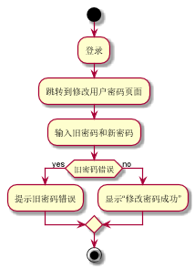

###     3.9 “修改密码”用例
|||
|:-------|:-------------| 
|用例名称|修改密码|
|参与者|超级管理员、图书管理员、读者|
|前置条件|超级管理员、图书管理员或读者登录到系统|
|后置条件|产生并保存修改记录和修改后的密码|
|主事件流|
|参与者动作|系统行为|
|1.超级管理员、图书管理员或读者跳转到修改密码的页面；<br>2.超级管理员、图书管理员或读者填写旧密码及新密码；|<br><br>3.系统保存新密码，用例结束；|
|备选事件流|
|1a.旧密码输入错误<br>&nbsp;&nbsp;&nbsp;&nbsp;1.系统提示旧密码输入错误|
|业务规则|
|1.用户的编号不能修改<br>2.登录才能修改|
<br>

**“修改密码”用例流程图源码如下：**
``` 
@startuml
start
:登录;
:跳转到修改用户密码页面;
:输入旧密码和新密码;
if (旧密码错误) then (yes)
:提示旧密码错误;
else (no)
:显示“修改密码成功”;
endif
stop
@enduml
```
<br>

**“修改密码”用例流程图源码如下：**
<br>
