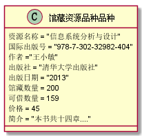

# 实验3：图书管理系统领域对象建模
|学号|班级|姓名|
|:-------:|:-------------: | :----------:|
|201510414312|软件(本)15-3|邱小霞|

## 1. 图书管理系统的类图

### 1.1 类图PlantUML源码如下：

``` class
@startuml
class 馆藏目录 {
    文献编号
    文献名
    文献信息
}
class 馆藏资源品种{
      资源名称
      国际出版号
      价格
      简介
      馆藏数量
      可借数量
}
class 资源项{
    馆藏流水号
    状态
}
class 预定记录{
    预定日期
}

class 图书品种{
    作者
    出版社
    出版日期
}
class 读者{
    姓名
    身份证号
    借书卡号
    图书限额
    有借图书数
}
class 图书管理员{
    职工号
    姓名
}
class 逾期记录{
    逾期天数
}
class 罚款细则{
    逾期天数
    罚款规则
}
馆藏目录 "0..*" - "1..*" 馆藏资源品种
馆藏资源品种 "1" *- "*" 资源项 :    拥有
预定记录 "*" -- "1"馆藏资源品种 : 被预定
馆藏资源品种 <|-- 图书品种
预定记录 "*" -- "1" 读者
资源项 "1" -- "0..1"借书记录
图书管理员 "1" - "*" 借书记录 : 登记
借书记录 "*" - "1" 读者
借书记录 "1" --  "0..1" 逾期记录
逾期记录 "*" - "0..1" 罚款细则 : 使用

@enduml
```

### 1.2. 类图如下：

参见图7.6


### 1.3. 类图说明：
馆藏目录：这个类的属性包括 文献编号、文献名、文献信息等属性。可通过此类查询图书馆是否有此类图书。由实列维护书目产生，由维护书目和查询书目等实列应用。
馆藏资源品种：这个类的属性包括 资源名称、国际出版号、价格、馆藏数量、可借数量等。由实列维护书目产生，由维护书目和查询书目等实列应用。
资源项：这个类的属性包括 馆藏流水号、状态（状态有借出、未借出）等。由实列借出图书、归还图书产生，由归还图书等实列应用。
预定记录：这个类的属性包括 预定日期等。由实列预定图书产生，由实列取消预定应用。
图书品种：此类继承自馆藏资源品种，这个类的属性包括 作者、出版社、出版日期及所继承的属性等。由实列维护书目产生，由维护书目、借出图书、归还图书和预定图书等实列应用。
读者:这个类的属性包括 姓名、身份证号、借书卡号、图书限额、有借图书数、碟片限额、已借碟片数等。由实列维护读者信息产生，由借出图书、归还图书、预定图书、修改密码和维护读者信息等实列应用。
图书管理员：这个类的属性包括 职工号、姓名等。由实列维护图书管理员信息产生，由维护图书管理员信息和修改密码等实列应用。
逾期记录：这个类的属性包括 逾期天数等由实列借出图书和归还图书产生，由实列归还图书应用。
罚款细则：这个类的属性包括逾期天数、罚款规则等。当罚款金额超过图书售价，罚款金额将不再随时间增长。
## 2. 图书管理系统的对象图
### 2.1 类馆藏目录的对象图
#### 源码如下：
``` class
@startuml
class 馆藏目录 {
    文献编号 = "H109.4"
    文献名 = "现代汉语读本"
    文献信息 = "/武占坤著.北京汉语学院出版社.1986.7"
}
@enduml
``` 
#### 对象图如下：


### 2.2 类图书品种的对象图
#### 源码如下：
``` class
@startuml
class 图书品种{
  书名 = "信息系统分析与设计"
  国际书号 = "978-7-302-32982-404"
  作者 ="王小敏"
  出版社 = "清华大学出版社"
  馆藏数量 = 200
  可借数量 = 159
}
@enduml
``` 
#### 对象图如下：


### 2.3 类资源项的对象图
#### 源码如下：
``` class
@startuml
class 资源项{
    馆藏流水号 = "201803001"
    状态 = "借出"
}
@enduml
``` 
#### 对象图如下：


### 2.4 类预定记录的对象图
#### 源码如下：
``` class
@startuml
class 预定记录{
预定日期 = 20181011
读者编号 = "201510414312"
}
@enduml
``` 
#### 对象图如下：


### 2.5 类罚款细则的对象图
#### 源码如下：
``` class
@startuml
class 罚款细则{
逾期天数 = 7
罚款规则（元/天） = 0.2
}
@enduml
``` 
#### 对象图如下：


### 2.6类读者的对象图
#### 源码如下：
``` class
@startuml
class 读者{
    姓名 = "XXX"
    密码 = "......"
    身份证号 = "555044499301053856"
    借书卡号 = "201510414312"
    图书限额 = 30
    已借图书数 = 20
}
@enduml
``` 
#### 对象图如下：


### 2.7 类图书管理员的对象图
#### 源码如下：
``` class
@startuml
class 图书管理员{
职工号 = "201310464210"
姓名 = "XXX"
密码 = "......."
}
@enduml
``` 
#### 对象图如下：


### 2.8 类逾期记录的对象图
#### 源码如下：
``` class
@startuml
class 逾期记录{
逾期天数 = 12
读者编号 = "201510414312"
}
@enduml
``` 
#### 对象图如下：

