# 实验4：图书管理系统顺序图绘制
|学号|班级|姓名|
|:-------:|:-------------: | :----------:|
|201510414312|软件(本)15-3|邱小霞|

## 图书管理系统的顺序图

## 1. 查询书目用例
## 1.1. 查询书目用例PlantUML源码

``` sequence
@startuml
title
 查询书目
 <u>说明：图中的“/”均表示“或者”</u>
end title
skinparam sequenceArrowThickness 2
skinparam maxmessagesize 60
skinparam sequenceParticipant underline
actor "读者/图书管理员/超级管理员" as U
participant "馆藏资源品种" as A
participant "查询记录" as B
activate U
U ->A:输入图书信息
activate A
A ->B:保存查询记录
deactivate A
activate B
B -->U:输出查询结果
deactivate B
@enduml
```

## 1.2. 查询书目用例顺序图
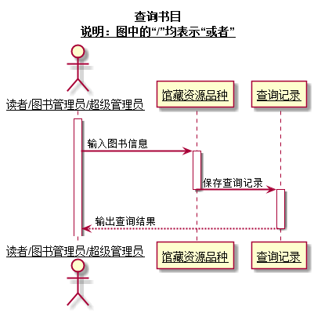

## 1.3. 查询书目用例顺序图说明
   此图为查询书目用例顺序图，用户有三种分别为：读者、图书管理员和超级管理员。用户输入想要查询的图书信息，系统查询并返回相关的图书信息，并且保存此次查询记录，为图书采购等操作提供依据。

***

## 2. 维护书目用例
## 2.1. 维护书目用例PlantUML源码

``` sequence
@startuml
title
 维护书目
 <u>说明：图中的“/”均表示“或者”</u>
end title
skinparam sequenceArrowThickness 2
skinparam maxmessagesize 60
skinparam sequenceParticipant underline
actor "图书管理员/超级管理员" as U
participant "馆藏资源品种" as A
participant "馆藏目录" as B
activate U
U ->A:输入查询内容
activate A
A -->U:输出所查询的书目
deactivate A
U ->A:输入所要添加/修改/删除的书目信息
activate A
A ->A:添加/修改/删除书目
A -->U:提示“添加/修改/删除成功”
deactivate A
U ->B:对应添加/修改/删除馆藏目录
activate B
B -->U:提示“添加/修改/删除成功”
deactivate B
@enduml
```

## 2.2. 维护书目用例顺序图
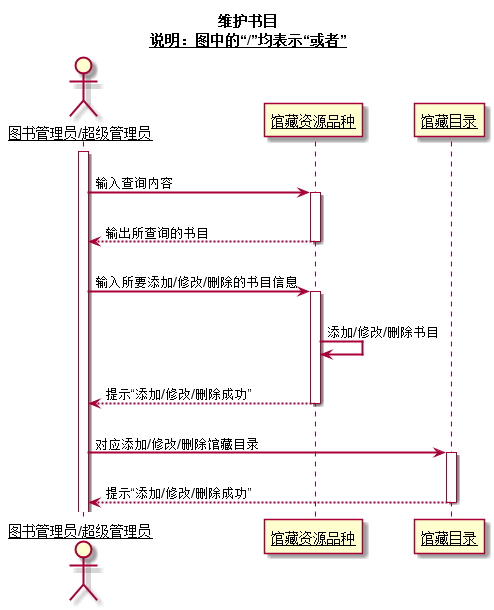

## 2.3. 维护书目用例顺序图说明
   此图为维护书目用例顺序图，用户有两种分别为：图书管理员和超级管理员。用户输入所要查询的书目的信息，系统返回查询到的书目及书目信息，从而实现查询书目；
   用户输入所要添加的书目信息，系统将对馆藏资源品种和馆藏目录进行添加操作，将新的书目添加到其中，最后提示用户添加书目成功，最终完成书目添加操作；
   用户输入所要修改的书目信息，系统将对馆藏资源品种和馆藏目录进行修改操作，最后提示用户修改书目成功，最终完成书目修改操作；
   用户输入所要删除的书目信息，系统将对馆藏资源品种和馆藏目录进行删除操作，最后提示用户删除书目成功，最终完成书目删除操作；
***


## 3. 取消预定用例
## 3.1. 取消预定用例PlantUML源码

``` sequence
@startuml
title
 取消预定
 <u>说明：图中的“/”均表示“或者”</u>
end title
skinparam sequenceArrowThickness 2
skinparam maxmessagesize 60
skinparam sequenceParticipant underline
actor 读者
participant "预定记录" as B
activate 读者
读者 ->B:取预定记录
activate B
B -->读者:返回该读者所有预定信息
deactivate B
读者 ->B:取消预定（删除预定记录）
activate B
B -->读者:提示“预定取消成功”
deactivate B
@enduml

```

## 3.2. 取消预定用例顺序图
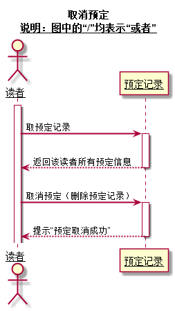

## 3.3. 取消预定用例顺序图说明
此图为取消预定用例顺序图，用户为读者。用户在取消预定之前，系统将取出所有预定记录并显示出来。
用户在显示页面上选择要取消预定的书目，在此之后系统根据用户的选择对预定记录执行删除操作，最后提示用户“预定取消成功”。
***


## 4. 预定图书用例
## 4.1. 预定图书用例PlantUML源码

``` sequence
@startuml
title
 预定图书
 <u>说明：图中的“/”均表示“或者”</u>
end title
skinparam sequenceArrowThickness 2
skinparam maxmessagesize 60
skinparam sequenceParticipant underline

actor 读者
participant "馆藏资源品种" as A
participant "预定记录" as B

activate 读者
读者 ->A:输入预定图书信息
activate A

A -->读者:返回所有可能预定的图书
deactivate A

读者 ->A:选择预定图书
activate A

A ->B:生成预定记录
deactivate A
activate B

B -->读者:输出预定结果
deactivate B

@enduml

```

## 4.2. 预定图书用例顺序图
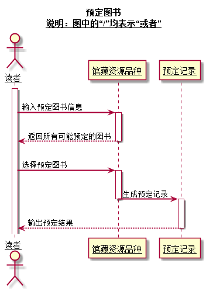

## 4.3. 预定图书用例顺序图说明
此图为预定用例顺序图，用户为读者。用户输入预定图书信息，系统将取出所有可能预定的图书信息并显示出来。
用户在显示页面上选择要预定的书目，在此之后系统根据用户的选择生成预定记录，最后提示用户“预定图书成功”。
***


## 5. 借出图书用例
## 5.1. 借出图书用例PlantUML源码

``` sequence
@startuml
title
 借出图书
 <u>说明：图中的“/”均表示“或者”</u>
end title
skinparam sequenceArrowThickness 2
skinparam maxmessagesize 60
skinparam sequenceParticipant underline

actor "图书管理员/超级管理员" as U
participant "读者" as A
participant "资源项" as B
participant "馆藏资源品种" as C
participant "借书记录" as D

activate U

U ->A:验证读者
activate A
deactivate A

U ->A:取读者限额
activate A
deactivate A

loop

U ->B:获取资源项
activate B

B ->C:查找资源品种
activate C
deactivate C
deactivate B

U ->D:创建借书记录
activate D
deactivate D

U ->B:借出资源
activate B

B ->C:减少可借数量
activate C
deactivate C

U ->A:减少可用限额
deactivate B
activate A

end

U ->D:打印借书清单
deactivate A
activate D
deactivate D

@enduml

```

## 5.2. 借出图书用例顺序图
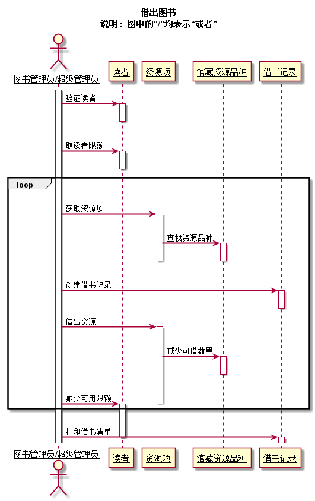

## 5.3. 借出图书用例顺序图说明
 &nbsp;&nbsp;&nbsp;&nbsp;&nbsp;&nbsp;&nbsp;&nbsp;此图为借出图书用例顺序图，用户有两种分别为：图书管理员和超级管理员。
 首先，用户要验证是否存在该读者，之后获取该读者的借书限额，如果借书不会超过限额，则获取资源项，查找资源品种，之后生成借书记录。
 用户借出图书后减少该书目的可借数量和读者的可借限额。最后用户根据读者的意愿打印借书清单。
 因为读者可能一次借多本书，所以取读者限额和打印借书清单之间是一个循环操作。
***


## 6. 归还图书用例
## 6.1. 归还图书用例PlantUML源码

``` sequence
@startuml
 title
  归还图书
  <u>说明：图中的“/”均表示“或者”</u>
 end title
 skinparam sequenceArrowThickness 2
 skinparam maxmessagesize 60
 skinparam sequenceParticipant underline
 
 actor "图书管理员/超级管理员" as U
 participant "资源项" as A
 participant "借书记录" as B
 participant "馆藏资源品种" as C
 participant "读者" as D
 participant "逾期记录" as E
 
 activate U
 
 U ->A:读取资源信息
 activate A
 
 
 A ->B:取借书记录
 activate B
 deactivate B
 
 A ->C:取资源品种
 activate C
 deactivate C
 deactivate A
 
 U ->D:取借阅者信息
 activate D
 deactivate D
 
 U ->B:归还资源
 activate B
 
 B ->C:增加可借数量
 activate C
 
 C ->D:增加可借数量
 activate D
 deactivate C
 deactivate D
 deactivate B
 
 U ->B:登记还书日期
 activate B
 deactivate B
 
 opt
 U ->E:登记逾期记录
 activate E
 deactivate E
 end
 @enduml

```

## 6.2. 归还图书用例顺序图
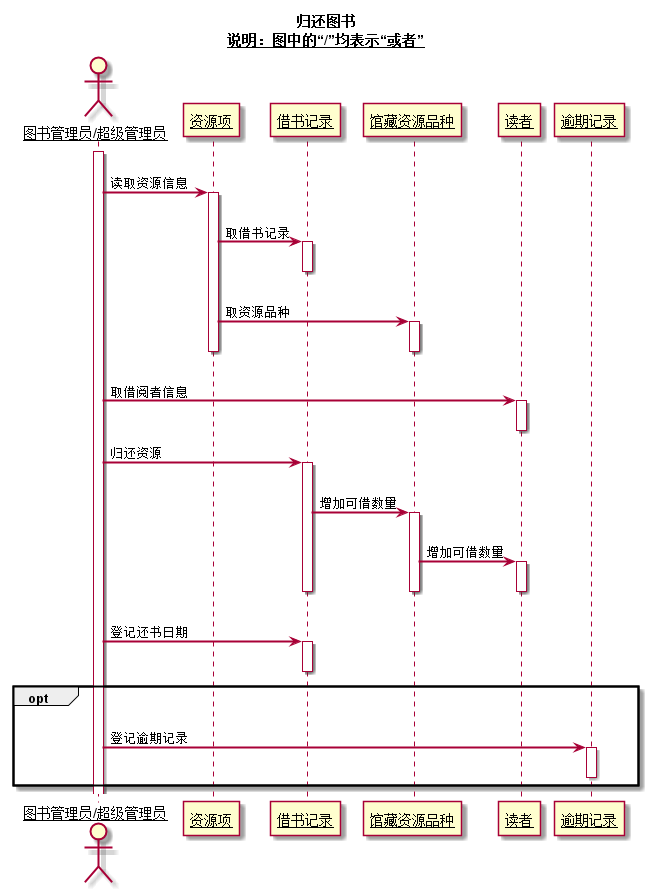

## 6.3. 归还图书用例顺序图说明
此图为归还图书用例顺序图，用户有两种分别为：图书管理员和超级管理员。
首先，用户获取资源信息、借书记录、资源品种和借阅者信息等还书相关的信息。
满足还书要求后，归还资源，增加该书目的可借数量，增加读者的可借限额，之后登记还书日期。
如果读者还书逾期，用户登记逾期记录。
***


## 7. 维护读者信息用例
## 7.1. 维护读者信息用例PlantUML源码

``` sequence
@startuml
title
 维护读者信息
 <u>说明：图中的“/”均表示“或者”</u>
end title

skinparam sequenceArrowThickness 2
skinparam maxmessagesize 60
skinparam sequenceParticipant underline

actor "图书管理员/超级管理员" as U
participant "读者" as A

activate U

U ->A:输入读者信息
activate A
A -->U:输出所查询的读者的信息
deactivate A

U ->A:输入所要添加/修改/删除的读者信息
activate A

A ->A:添加/修改/删除读者


A -->U:提示“添加/修改/删除成功”
deactivate A
@enduml

```

## 7.2. 维护读者信息用例顺序图
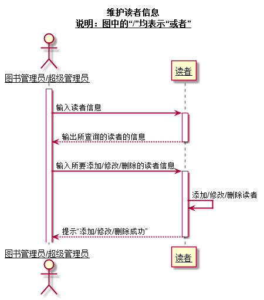

## 7.3. 维护读者信息用例顺序图说明
此图为维护读者信息用例顺序图，用户有两种分别为：图书管理员和超级管理员。用户输入查询读者的信息，系统返回查询到的读者信息，从而实现查询读者信息的操作；
   用户输入所要添加的读者信息，系统将添加新的读者，最后提示用户添加读者成功，最终完成读者添加操作；
   用户输入所要修改的读者信息，系统将对该读者的信息进行修改操作，最后提示用户修改读者信息成功，最终完成读者信息修改操作；
   用户输入所要删除的读者信息，系统将删除该读者，最后提示用户删除读者成功，最终完成读者删除操作；
***


## 8. 详细信息修改用例
## 8.1. 详细信息修改用例PlantUML源码

``` sequence
@startuml
title
 详细信息修改
 <u>说明：图中的“/”均表示“或者”</u>
end title
skinparam sequenceArrowThickness 2
skinparam maxmessagesize 60
skinparam sequenceParticipant underline

actor "读者/图书管理员/超级管理员" as U
participant "该读者详细信息" as A

activate U
U ->A:输入修改内容
activate A

A -->U:输出修改结果\n
deactivate A

@enduml

```

## 8.2. 详细信息修改用例顺序图
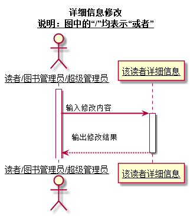

## 8.3. 详细信息修改用例顺序图说明
此图为详细信息修改用例顺序图，用户为读者、图书管理员和超级管理员。用户修改详细信息后提交，系统将显示修改结果。
***


## 9. 修改密码用例
## 9.1. 修改密码用例PlantUML源码

``` sequence
@startuml
title
 修改密码
 <u>说明：图中的“/”均表示“或者”</u>
end title
skinparam sequenceArrowThickness 2
skinparam maxmessagesize 60
skinparam sequenceParticipant underline

actor "图书管理员/超级管理员/读者" as U
participant "密码" as A

activate U
U ->A:输入旧密码\n
activate A
deactivate A

U ->A:输入新密码
activate A

A -->U:提示“修改密码成功”\n
deactivate A
@enduml
```

## 9.2. 修改密码用例顺序图
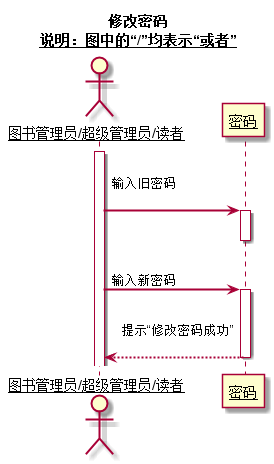

## 9.3. 修改密码用例顺序图说明
此图为修改密码用例顺序图，用户为读者、图书管理员和超级管理员。用户根据提示输入旧密码和新密码，之后系统提示“修改密码成功”。

***


## 10. 查询借阅情况用例
## 10.1. 查询借阅情况用例PlantUML源码

``` sequence
@startuml
title
 查询借阅情况
 <u>说明：图中的“/”均表示“或者”</u>
end title
skinparam sequenceArrowThickness 2
skinparam maxmessagesize 60
skinparam sequenceParticipant underline

actor 读者
participant "借书记录" as B

activate 读者

读者 ->B:取借书记录
activate B

B -->读者:返回该读者所有借书记录\n
deactivate B
@enduml
```

## 10.2. 查询借阅情况用例顺序图
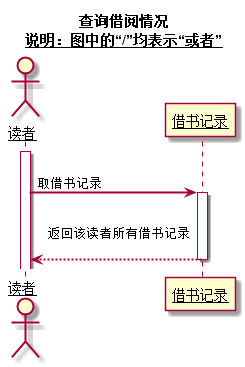

## 10.3. 查询借阅情况用例顺序图说明
此图为查询借阅情况用例顺序图，用户为读者。系统取出该用户所有借书记录并显示在用户界面上。

***


## 11. 维护图书管理员信息用例
## 11.1. 维护图书管理员信息用例PlantUML源码

``` sequence
@startuml
title
 维护图书管理员信息
 <u>说明：图中的“/”均表示“或者”</u>
end title

skinparam sequenceArrowThickness 2
skinparam maxmessagesize 60
skinparam sequenceParticipant underline

actor "超级管理员" as U
participant "图书管理员" as A

activate U

U ->A:输入图书管理员信息
activate A
A -->U:输出所查询的图书管理员的信息
deactivate A

U ->A:输入所要添加/修改/删除的图书管理员信息
activate A

A ->A:添加/修改/删除图书管理员

A -->U:提示“添加/修改/删除成功”
deactivate A
@enduml
```

## 11.2. 维护图书管理员信息用例顺序图
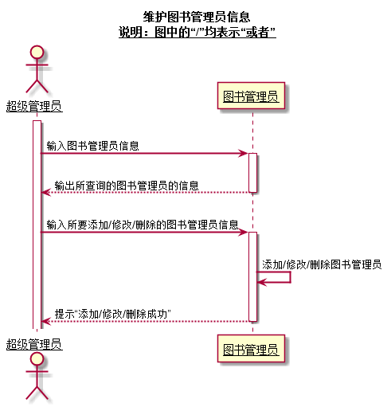

## 11.3. 维护图书管理员信息用例顺序图说明
此图为维护图书管理员信息用例顺序图，用户为：超级管理员。用户输入查询图书管理员的信息，系统返回查询到的图书管理员信息，从而实现查询图书管理员信息的操作；
   用户输入所要添加的图书管理员信息，系统将添加此新的图书管理员，之后提示用户添加图书管理员成功，最终完成图书管理员添加操作；
   用户输入所要修改的图书管理员信息，系统将对该图书管理员的信息进行修改操作，最后提示用户修改图书管理员信息成功，最终完成图书管理员信息修改操作；
   用户输入所要删除的图书管理员信息，系统将删除该图书管理员，最后提示用户删除图书管理员成功，最终完成图书管理员删除操作；
***
