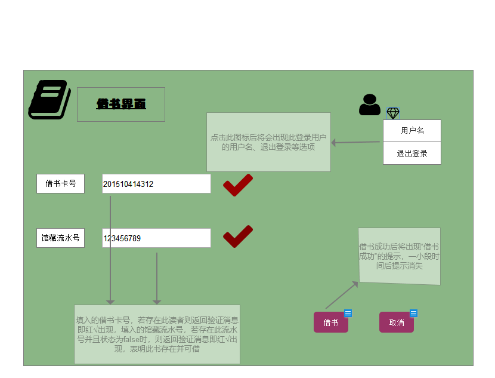

# 实验5：图书管理系统数据库设计与界面设计
|学号|班级|姓名|
|:-------:|:-------------: | :----------:|
|201510414312|软件(本)15-3|邱小霞|

## 1.数据库表设计
**_说明：1.所有的主键都是按照一定规律自动生成，不采用手动输入的方式。2.所有关于时间的属性都采用自动获取服务器时间为准，同样不采用手动输入的方式。_**
## 1.1. 馆藏目录表
|字段|类型|主键，外键|可以为空|默认值|约束|说明|
|:-------:|:-------------:|:------:|:----:|:---:|:----:|:-----|
|DOCUNUM|varchar2(100)|主键|否| | |文献编号|
|DOCUNAME|varchar2(100)| |否| | |文献名|
|DOCUDETAIL|varchar2(300)| |是|空 | |文献信息|

## 1.2. 图书表
|字段|类型|主键，外键|可以为空|默认值|约束|说明|
|:-------:|:-------------:|:------:|:----:|:---:|:----:|:-----|
|BOOKNUM|varchar2(100)|主键 |否| | |图书编号|
|BOOKNAME|varchar2(100)| |否| | |资源名称(书名)|
|ISBN|varchar2(100)| |否| | |国际出版号|
|AUTHOR|varchar2(100)| |否| | |作者|
|PUBLISH|varchar2(100)| |否| | |出版社|
|PUBLISHDATE|varchar2(100)| |否| | |出版日期|
|STIRENUM|number| |否| |大于0的正整数 |馆藏数量|
|BCBORRNUM|number| |否| |大于等于0的正整数 |可借数量|
|PRICE|float| |否| | 大于0|价格|
|CONTENT|varchar2(100)| |是| 空| |简介|

## 1.3. 资源项表
|字段|类型|主键，外键|可以为空|默认值|约束|说明|
|:-------:|:-------------:|:------:|:----:|:---:|:----:|:-----|
|SERIALNUM|varchar2(100)|主键 |否| | |馆藏流水号|
|BOOKNUM|varchar2(100)|外键|否| | |图书编号|
|STATUS|boolean| |是|false | |状态，false为没有借出，true为借出|

## 1.4. 预定记录表
|字段|类型|主键，外键|可以为空|默认值|约束|说明|
|:-------:|:-------------:|:------:|:----:|:---:|:----:|:-----|
|ORDERNUM|varchar2(100)|主键|否| | |预定编号|
|ORDERDATE|date| |否| | |预定日期|
|READERNUM|varchar2(100)|外键|否| | |读者编号（读者的借书卡号）|

## 1.5. 读者表
|字段|类型|主键，外键|可以为空|默认值|约束|说明|
|:-------:|:-------------:|:------:|:----:|:---:|:----:|:-----|
|READERNUM|varchar2(100)|主键|否| | |借书卡号|
|READERNAME|varchar2(100)| |否| | |姓名|
|PASSWORD|varchar2(100)| |否| | |密码|
|IDNUM|varchar2(100)| |是|空| |身份证号|
|RBOOKLIMIT|number| |否| |大于等于0的正整数|图书限额|
|RDBORRLIMIT|number| |否| |大于等于0的正整数|已借数量|

## 1.6. 图书管理员表
|字段|类型|主键，外键|可以为空|默认值|约束|说明|
|:-------:|:-------------:|:------:|:----:|:---:|:----:|:-----|
|STAFFNUM|varchar2(100)|主键|否| | |职工号|
|STAFFNAME|varchar2(100)| |否| | |姓名|
|PASSWORD|varchar2(100)| |否| | |密码|

## 1.7. 逾期记录表
|字段|类型|主键，外键|可以为空|默认值|约束|说明|
|:-------:|:-------------:|:------:|:----:|:---:|:----:|:-----|
|BORRNUM|varchar2(100)|主键、外键|否| | |逾期编号同时与“借书记录表”中“记录编号”相同|
|OVERDUEDAY|date| |否| | |逾期天数|
|READERNUM|varchar2(100)|外键|否| | |读者编号|

## 1.8. 借书记录表
|字段|类型|主键，外键|可以为空|默认值|约束|说明|
|:-------:|:-------------:|:------:|:----:|:---:|:----:|:-----|
|BORRNUM|varchar2(100)|主键|否| | |记录编号|
|SERIALNUM|varchar2(100)|外键|否| | |馆藏流水号|
|READERNUM|varchar2(100)|外键|否| | |借书卡号|
|BORRDATE|data| |否| | |借书日期|
|CRETURNDATE|data| |否| | |应还书日期|
|RETURNDATE|data| |是| |空|还书日期|

## 1.9. 罚款细则表
|字段|类型|主键，外键|可以为空|默认值|约束|说明|
|:-------:|:-------------:|:------:|:----:|:---:|:----:|:-----|
|LATEDAY|varchar2(100)|主键|否| |大于0的正整数|逾期天数|
|RULE|varchar2(100)| |否| | |罚款规则|
***

## 2. 界面设计
## 2.1. 借书界面设计

- 用例图参见：借书用例
- 类图参见：借书类，读者类
- 顺序图参见：借书顺序图
- API接口如下：

1. 用户退出登录API
- 功能：用于获取登录用户的信息
- 请求地址： http://BookMange/v1/api/adminExit
- 请求方法：POST
- 请求参数：

|参数名称|必填|说明|
|:-------:|:-------------: | :----------:|
|staffNum|是|用户的uid（这里的用户是图书管理员）|
|access_token|是|用于验证请求合法性的认证信息。 |
|method|是|固定为 “POST”。|

- 返回实例：
```
{
    "info": "退出成功",
    "data": [
        {
          "STAFFNUM": "001",
          "STAFFNAME": "xxx"
         } 
     ], 
    "code": 200
}
```
- 返回参数说明：
    
|参数名称|说明|
|:-------:|:-------------: |
|Info|返回信息|
|data|用户的个人信息（这里的用户是图书管理员）,密码为了安全不予显示|
|dodo|返回码|

2. 返回借书结果的API
- 功能：用于获取借书结果
- 请求地址： http://BookMange/v1/api/borrowResult
- 请求方法：POST

|参数名称|必填|说明|
|:-------:|:-------------: | :----------:|
|access_token|是|用于验证请求合法性的认证信息。 |
|method|是|固定为 “POST”。|

- 返回实例：
```

{
    "info": "借书返回成功",
    "data": 
        {
          "BORRNUM" = "000001"
          "SERIALNUM" = "000000101"
          "READERNUM" ="201510414312"
          "BORRDATE" ="2018.5.6 17:32"
          "CRETURNDATE" ="2018.6.6 17:32"
          "RETURNDATE" = ""
        },
    "code": 200
}
```
- 返回参数说明：
    
|参数名称|说明|
|:-------:|:-------------: |
|Info|返回信息|
|data|生成的借书记录|
|dodo|返回码|

3. 验证读者编号API
- 功能：验证用户名
- 请求地址：http://BookMange/v1/api/verifyReader
- 请求方法：POST
- 请求参数：

|参数名称|必填|说明|
|:-------:|:-------------: | :----------:|
|access_token|是|用于验证请求合法性的认证信息。 |
|method|是|固定为 “POST”。|

- 返回实例：
```

{
    "info": "存在此读者",
    "data": [
        {
          "READERNUM" = "201510414312"
          "READERNAME" = "qxx"
          "IDNUM" ="xxxxxxxx"
          "RBOOKLIMIT" ="30"
          "RDBORRLIMIT" = "8"
        }
    ],
    "code": 200
}
```
- 返回参数说明：
    
|参数名称|说明|
|:-------:|:-------------: |
|Info|返回信息|
|data|查询到的读者信息，密码为了安全不予显示|
|dodo|返回码|

 4. 验证图书编号API
 - 功能：验证图书编号
 - 请求地址：http://BookMange/v1/api/verifyBook
 - 请求方法：POST
 - 请求参数：
 
 |参数名称|必填|说明|
 |:-------:|:-------------: | :----------:|
 |access_token|是|用于验证请求合法性的认证信息。 |
 |method|是|固定为 “POST”。|
 
 - 返回实例：
 ```
 
 {
 "info": "存在此类图书",
     "data": [
         {
             "BOOKNAME" = "信息系统分析与设计"
             "ISBN" = "978-7-302-32982-404"
             "AUTHOR" ="王小敏"
             "PUBLISH" = "清华大学出版社"
             "PUBLISHDATE" = "2013"
             "STIRENUM" = 200
             "BCBORRNUM" = 159
             "PRICE" = 45
             "CONTENT" = "本书共十四章...."
         }
     ],
     "code": 200
 }
 ```
 - 返回参数说明：
     
 |参数名称|说明|
 |:-------:|:-------------: |
 |Info|返回信息|
 |data|查询到的图书信息|
 |dodo|返回码|
