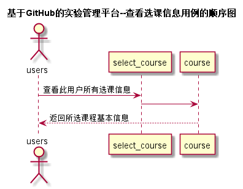

<!-- markdownlint-disable MD033-->
<!-- 禁止MD033类型的警告 https://www.npmjs.com/package/markdownlint -->

# “查看选课信息”用例 [返回](../README.md)
## 1. 用例规约

|用例名称|查看用户信息|
|-------|:-------------|
|功能|查看用户的所有信息|
|参与者|学生，老师|
|前置条件|必须先登录|
|后置条件| |
|主流事件| |
|备注| |

## 2. 业务流程
 

## 3. 界面设计
- 界面参照: https://q1314520xx.github.io/is_analysis/test6/ui/查看选课信息.html
- API接口调用 
    - 接口1：[getSelectCourseInfo](../接口/getSelectCourseInfo.md)

## 4. 算法描述
无

## 5. 参照表
- [STUDENTS](../数据库设计.md/#STUDENTS)
- [TEACHERS](../数据库设计.md/#TEACHERS)
- [COURSE](../数据库设计.md/#COURSE)
- [SELECT_COURSE](../数据库设计.md/#SELECT_COURSE)

