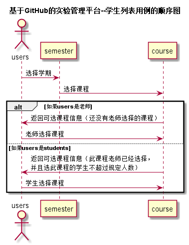

<!-- markdownlint-disable MD033-->
<!-- 禁止MD033类型的警告 https://www.npmjs.com/package/markdownlint -->

# “选课”用例 [返回](../README.md)
## 1. 用例规约

|用例名称|修改用户信息|
|-------|:-------------|
|功能|修改用户的GitHub用户名称|
|参与者|学生，老师|
|前置条件|必须先登录|
|后置条件| |
|主流事件|选课|
|备注| |

## 2. 业务流程
 

## 3. 界面设计
- 界面参照: https://q1314520xx.github.io/is_analysis/test6/ui/选课.html
- API接口调用
    - 接口1：[getSelectCourseInfo](../接口/getSelectCourseInfo.md)
    - 接口2：[setSelectCourse](../接口/setSelectCourse.md)
    
## 4. 算法描述
无
    
## 5. 参照表
- [COURSE](../数据库设计.md/#COURSE)
- [SELECT_COURSE](../数据库设计.md/#SELECT_COURSE)
